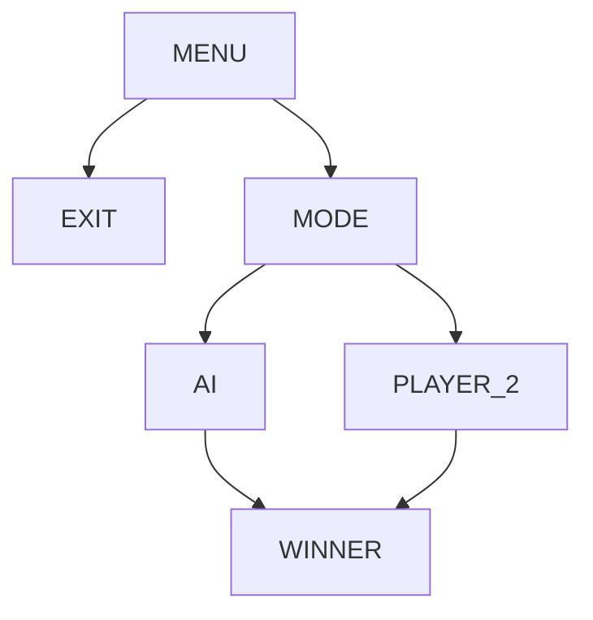
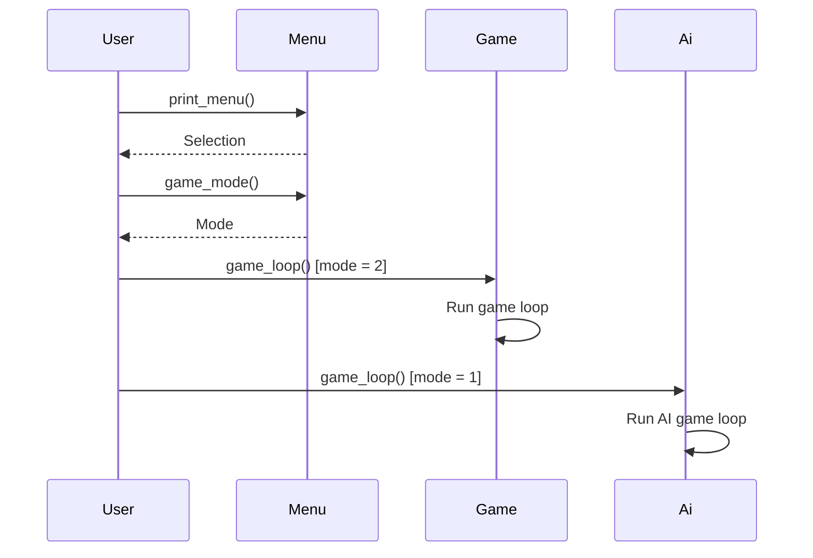

# Toteutusdokumentti
## Ohjelman yleisrakenne

## Saavutetut aika- ja tilavaativuudet
Tarkastellaan Ai luokan metodeja:

game_loop: Pääsilmukka vuorottelee pelaajan 1 ja tekoälyn siirtoja. Aikavaativuus riippuu pelin kestosta. Tilavaativuus on vakio, koska pelilautaa päivitetään samassa muuttujassa.

find_best_move: Käyttää minimax-algoritmia tekoälyn parhaan siirron etsimiseen. Aikavaativuus on yleensä eksponentiaalinen minimax-algoritmin syvyyden ja mahdollisten siirtojen määrän suhteen.

minimax: Minimax-algoritmi käyttää alpha-beta-karsintaa, joka parantaa suorituskykyä huomattavasti verrattuna tavalliseen minimaxiin. Aikavaativuus on O(b^d), jossa b on mahdollisten siirtojen määrä(esimerkiksi 7 saraketta pelilaudassa) ja d on rekursion syvyys.

is_winning_move ja evaluate_line: Käyvät läpi kiinteän määrän peliruutuja, joten aikavaativuus on vakio.

evaluate_position: Arvioi pelitilanteen pelaajan näkökulmasta. Aikavaativuus riippuu laudan koosta ja käsiteltävien rivien ja sarakkeiden määrästä.

Ai luokan self.board ja temp_board ovat 6x7 -kokoisia taulukoita, joten tilavaativuus on vakio.

Yhteenvetona, koodin suoritus voi olla hidasta minimax-algoritmin syvemmissä rekursiotasoissa. Alpha-beta-karsinta auttaa tehokkaasti vähentämään tarvittavien laskentatoimenpiteiden määrää ja nopeuttamaan algoritmin suoritusta. Yleisesti ottaen aikavaativuus noudattaa "O(b^d)" -kaavaa minimax-algoritmin osalta. Tilavaativuus on pääasiassa vakio, koska käytetyt taulukot ovat kiinteän kokoisia.
## Puutteita ja parannusehdotuksia
* Pelin toteutus pygamella.
* Mahdollisuus aloittaa uusipeli pelin päätyttyä.
* Mahdollisuus poistua pelistä muulloinkin kuin valikossa.
* Ai:n tehostaminen.
## Lähteitä
* https://tiralabra.github.io/2023_loppukesa/
* https://en.wikipedia.org/wiki/Connect_Four
* https://en.wikipedia.org/wiki/Minimax
