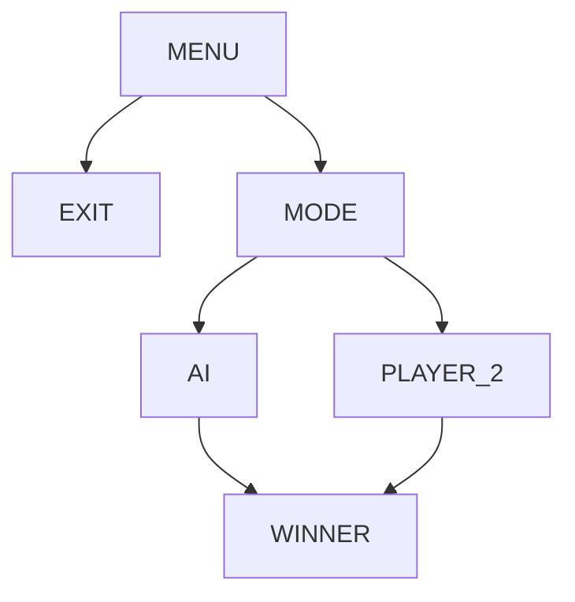
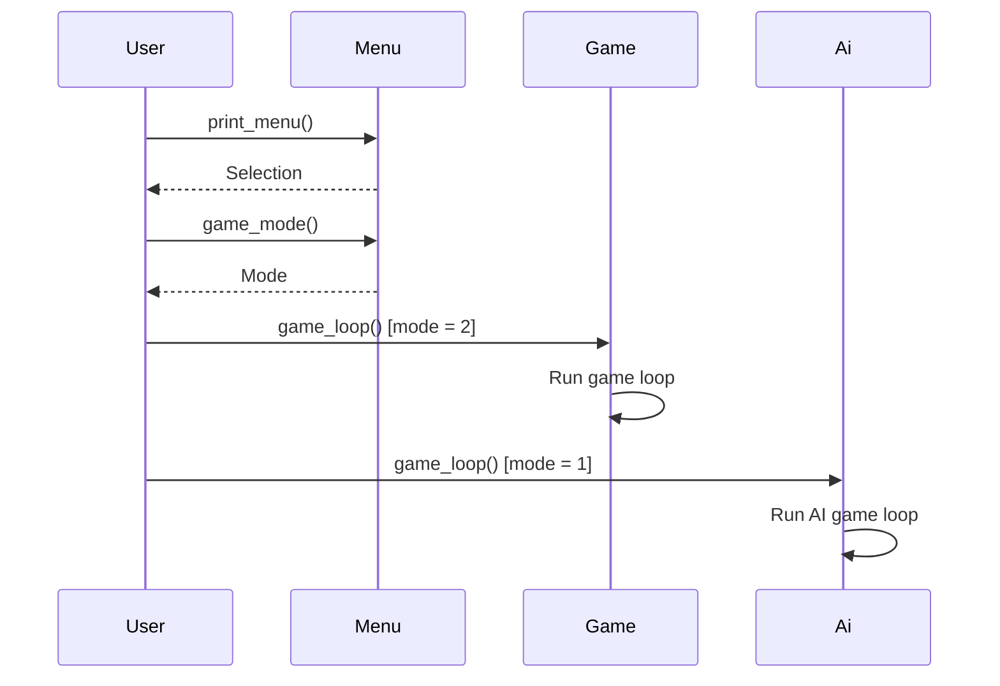

# Toteutusdokumentti
## Ohjelman yleisrakenne

## Saavutetut aika- ja tilavaativuudet
Lisään kun valmis.
## Puutteita ja parannusehdotuksia
* Pelin toteutus pygamella.
* Mahdollisuus aloittaa uusipeli pelin päätyttyä.
* Mahdollisuus poistua pelistä muulloinkin kuin valikossa.
* Ai:n tehostaminen.
## Lähteitä
* https://tiralabra.github.io/2023_loppukesa/
* https://en.wikipedia.org/wiki/Connect_Four
* https://en.wikipedia.org/wiki/Minimax
